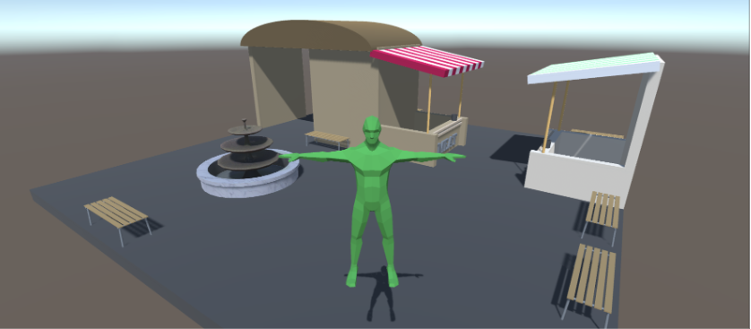
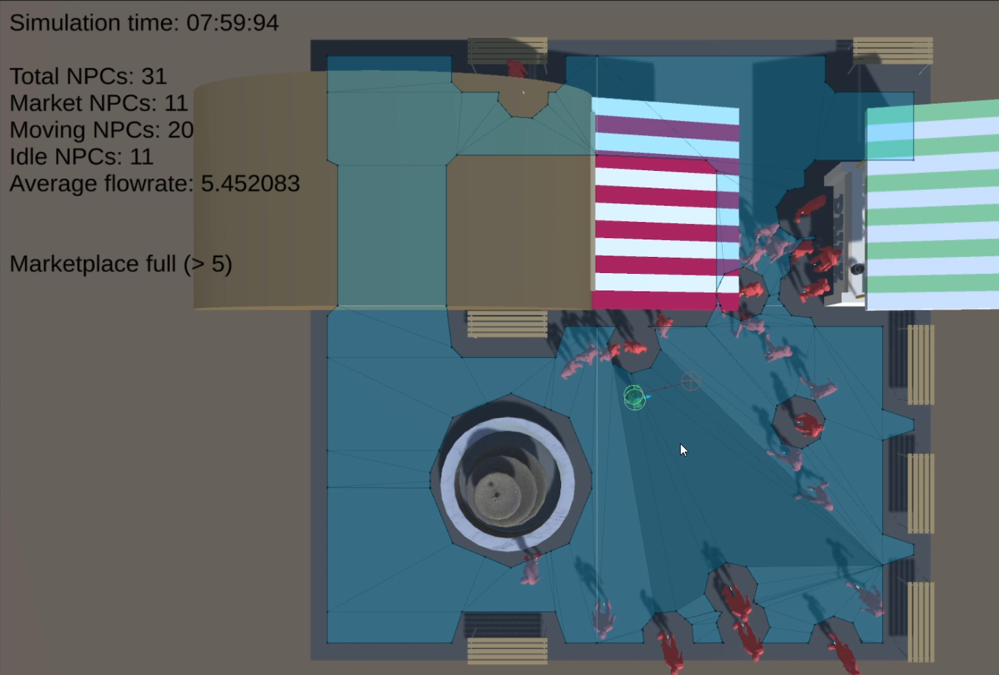
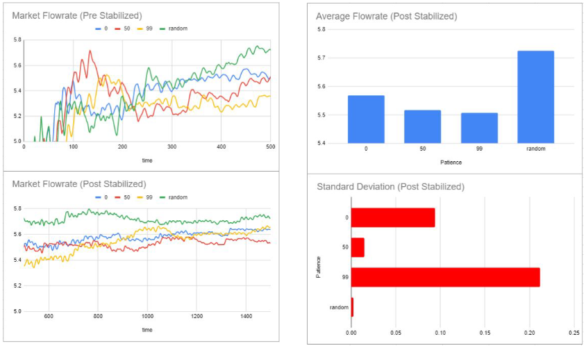

# Greed Aware Crowd Simulation

## Project Description
The movement of crowds in busy commercial districts is a complex phenomenon that has significant implications for urban planning and crowd management. Traditional crowd simulation methods often overlook the impact of individual attributes on crowd behavior, resulting in less realistic and inaccurate representations of real-world scenarios.

## Approach
The project proposes a novel approach that incorporates human-like behavior, specifically the impact of greed, to enhance the accuracy and applicability of crowd simulation systems. To address this issue, the project develops a virtual environment that allows for the visualization of crowd interactions and pathing around objects. A modified navigation-mesh-based algorithm is utilized to simulate individual pathing, taking into consideration factors such as congestion and obstacles to capture the complexities of crowd movement in commercial spaces.

## Greed Simulation
To simulate greed, a "patience" attribute is incorporated for each non-player character (NPC) in the simulation, which determines their likelihood of either pushing or swerving when in the path of another NPC.

#### Here is a sample of the simulation from a top-down view

## Results and Analysis
The study found that introducing variability in patience levels among NPCs can potentially lead to more efficient crowd movement with fewer clashes and disruptions. More information can be found in the research paper.

## Potential Applications
The proposed approach has the potential to improve the accuracy and realism of crowd simulation systems, with applications in urban planning, public safety, and crowd management. The findings of this research have the potential to provide valuable insights into the dynamics of crowd behavior in busy commercial districts and contribute to the field of crowd simulation by offering a more nuanced understanding of how individual attributes, such as patience and greed, influence crowd dynamics.

